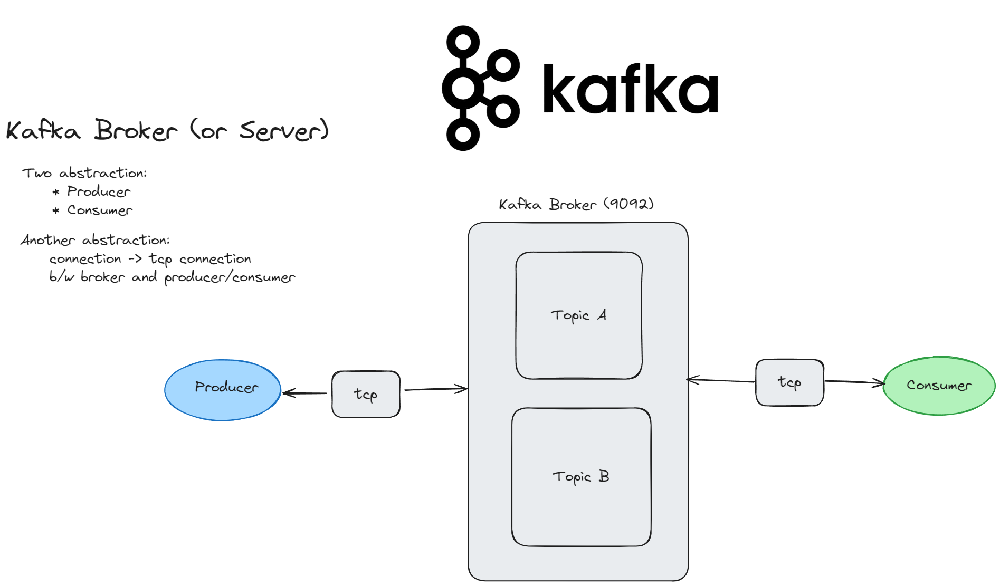
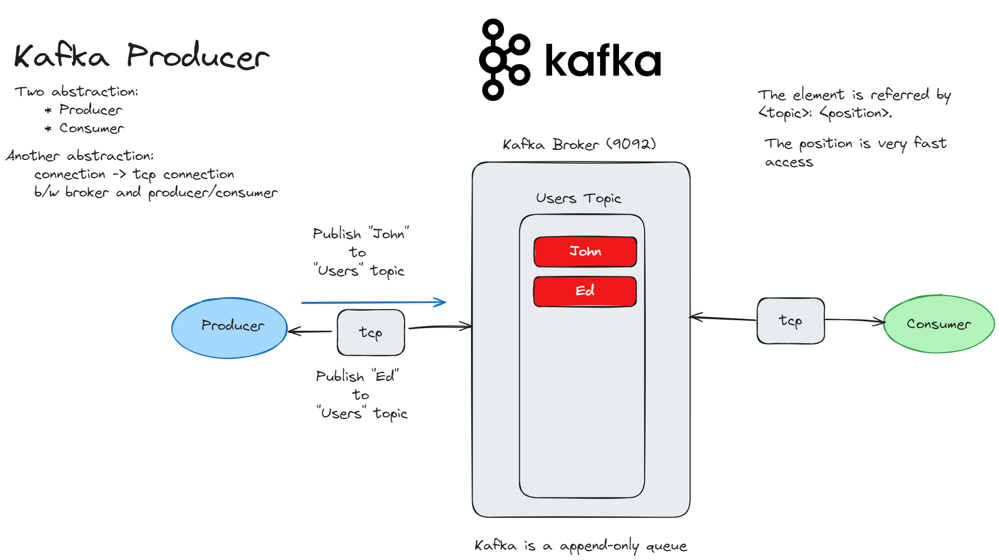
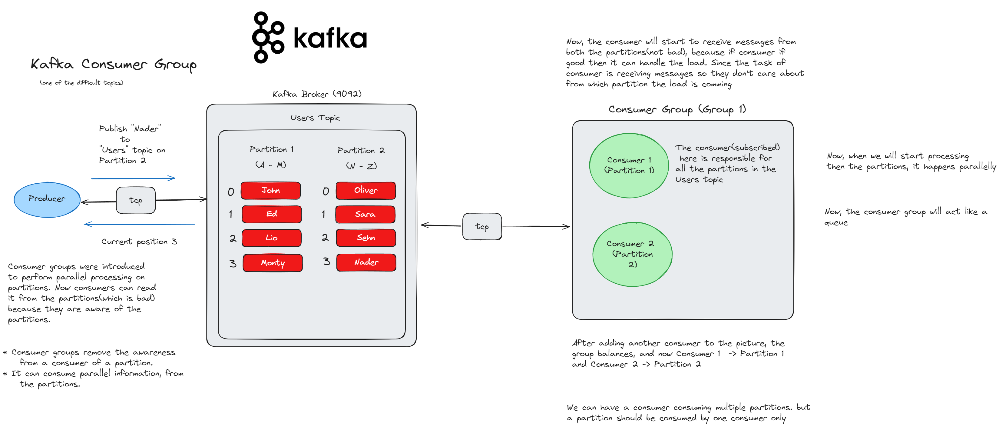
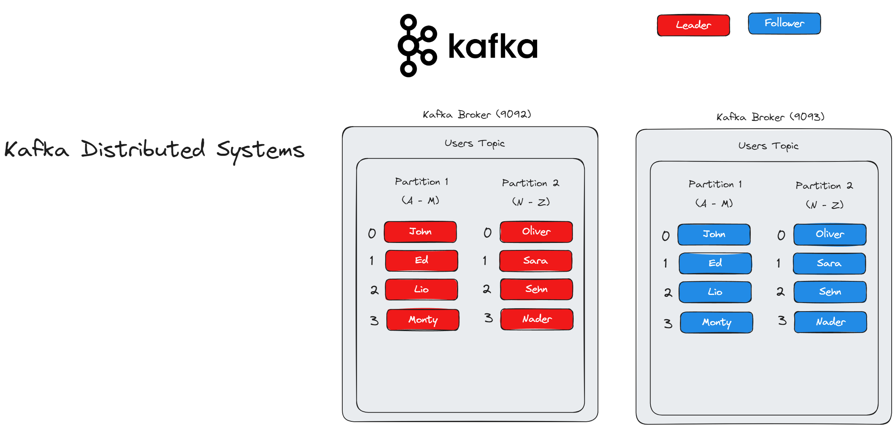
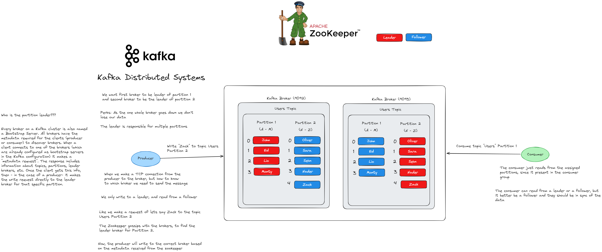

# Express + Kafka( Distributed Stream Processing System)


## Installation & Setup

To setup the node project

```
npm init -y
```

For the rest of the steps, we will be shifting to `pnpm`.

Installing `express`

```
pnpm i express @types/express 
```

Installing `typescript`

```
pnpm add typescript tsx -D
```

Installing `dotenv`

```
pnpm i dotenv --save
```

Installing `ts-node`

```
pnpm i typescript ts-node @types/node --save-dev 
```

Creating `tsconfig.json`

```
npx tsc --init
```

Installing `body-Parser`

```
pnpm i body-parser @types/body-parser
```

Installing `nodemon`

```
pnpm i nodemon --save-dev
```

Installing package for `Kafka`,

```
pnpm i kafkajs
```

### Installation : Kafka

For installation of `kafka` we will be using `docker`. To setup and run kafka, refer to the docker-compose file in the repo. 

## Architecture of Kafka

Kafka : Distributed Stream Processing System

### Kafka Broker



### Kafka Producer



### Kafka Consumer


### Kafka Partitions


### Queue vs Pub-Sub


* Queue  : Message published once, consumed once     (good for job execution, specially when we want to execute anything once)

* Pub - Sub : Message published once, consumed many times (mutlicast or broadcast the messages, we don't want to the data to be removed from our source)

* Kafka : How can we do both??

* Answer : Consumer Groups

### Consumer Groups



* To act like a queue, put all your consumers in one group

* To act like a pub/sub, put each consumer in a unique group

* Parallel processing

### Distributed Systems



### Zookeeper



## Observation on Kafka (Pros and Cons)

* Append only commit log (we write to the log, and the information append to the end) (WORM => Write Once Read Many)

    * We can append quickly in the end
    * We can traverse to the end very quickly
    * We can insert efficiently append data to the end(rather than having complex structures like B-Trees to change its structure or fragments on each push)

* Performance >> 
* Distributed
    * With zookeeper the concept is still append only log, we have a leader partition and can write to it
    * The data written to the leader will be copied to the follower partitions. 