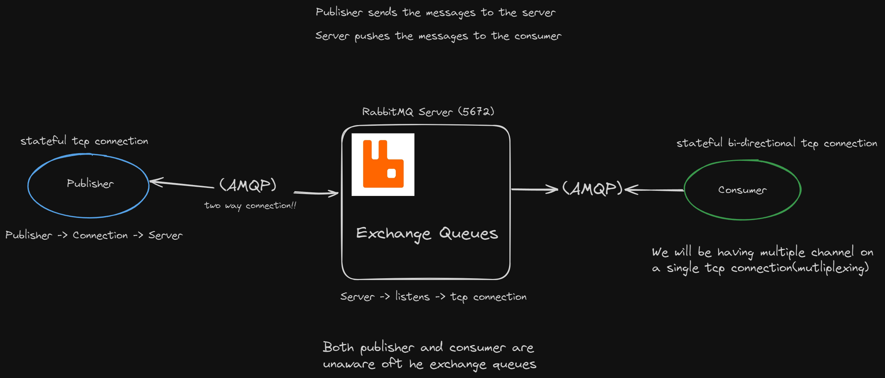
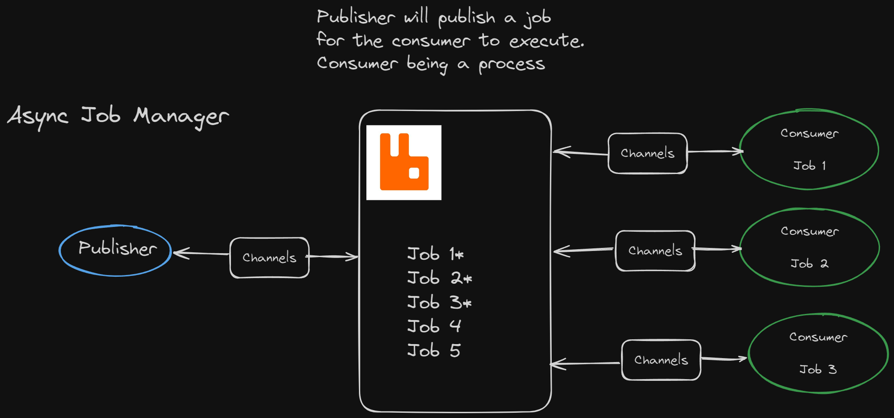

# Express + RabbitMQ


## Installation & Setup

To setup the node project

```
npm init -y
```

For the rest of the steps, we will be shifting to `pnpm`.

Installing `express`

```
pnpm i express @types/express 
```

Installing `typescript`

```
pnpm add typescript tsx -D
```

Installing `dotenv`

```
pnpm i dotenv --save
```

Installing `ts-node`

```
pnpm i typescript ts-node @types/node --save-dev 
```

Creating `tsconfig.json`

```
pnpx tsc --init
```

Installing `body-Parser`

```
pnpm i body-parser @types/body-parser
```

Installing `nodemon`

```
pnpm i nodemon --save-dev
```

Installing package for `RabbitMQ`, `amqp` protocol

```
pnpm i amqp
pnpm i @types/ampq -D
```

### Installation : RabbitMQ

For installation of `rabbitmq` we will be using `docker`. To setup and run rabbitmq, here the command for that:

```bash
docker run -it --rm --hostname my-rabbit --name some-rabbit -p 5672:5672 -p 15672:15672 -e RABBITMQ_DEFAULT_USER=user -e RABBITMQ_DEFAULT_PASS=password rabbitmq:3.13-management
```

In order to acces the management console, go to `localhost:15672`, and enter the username -> `user` and password -> `password`.

## Architecture of Rabbit MQ



## Aysnc Job Manager



## Observation on RabbitMQ

* Too many abstractions -> too many protocols (AMQP, HTTP....) -> Keep it simple -> Message Queue

* Complex systems  -> slow adoption

* Push Models -> complex!!

* Redis > RabbitMQ (in terms of Pub/Sub models)

* Does not scale good, as pushing too many messages, increases load on the consumer(consumer can't process messages this fast). Now we increase load on the server to slow down the pushing process(maximum queue limit). Unnecessary complexity on the server side.

* Kafka -> long polling model (pushes the complexity on the consumer -> letting them consume the messages when ever they want -> acknowledgement problem)

* YT has problem with notifications -> push based model

* Redis handles this issue effectively, as Redis is used for caching and situated deep in the backend -> number of clients on Redis < number of clients on RabbitMQ